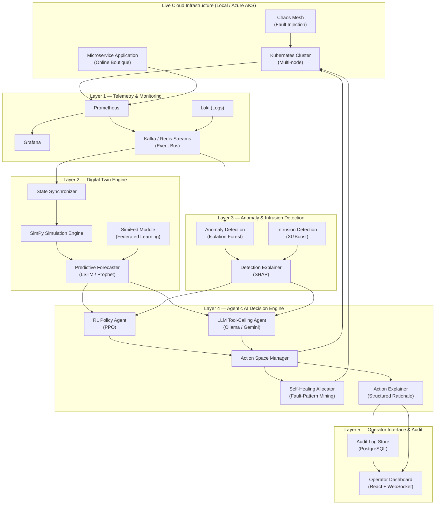

# Agentic AI Self-Healing Cloud Infrastructure — Implementation Plan

> A unified, scalable implementation merging the **SF-DTM** model (federated resource estimation + fault-tolerant allocation) with the **Agentic AI + Digital Twin + Explainable AI** three-layer architecture into a single deployable system.

---

## 1. High-Level Architecture Overview

The system is decomposed into **five major subsystems**:

---

## 2. Technology Stack

| Component | Technology | Justification |
|---|---|---|
| **Container Orchestration** | Kubernetes (k3s for Local, Azure AKS for Cloud) | Easy local testing with path to Azure production. |
| **Microservice App** | Google Online Boutique | Realistic microservice topology to test faults on. |
| **Metrics & Logs** | Prometheus + Grafana + Loki | De facto cloud-native monitoring standard. |
| **Event Bus** | Redis Streams / Kafka | Decouples telemetry producers from twin/detection consumers. |
| **Digital Twin Simulation** | Python + SimPy | Fast discrete-event simulation to model K8s resources. |
| **Federated Learning** | Flower (flwr) framework | Handles the SimiFed collaborative forecasting model. |
| **Anomaly & IDS** | scikit-learn (Isolation Forest) + XGBoost | Fast and robust models for telemetry and network flows. |
| **Explainability (XAI)**| SHAP | Feature attribution to explain why an anomaly was triggered. |
| **RL Agent** | Stable-Baselines3 (PPO) + Gymnasium | Learns long-term remediation policies in the twin environment. |
| **LLM Agent** | LangChain + Ollama (Local) / Gemini | Acts as an alternative/advisory decision maker with structured reasoning. |
| **Fault Injection** | Chaos Mesh | K8s-native chaos engineering to simulate pod crashes, CPU hogs, network delays. |
| **Dashboard** | React + Vite + WebSocket | Real-time observability for the operator to approve/audit decisions. |
| **Audit DB** | PostgreSQL | Relational storage for decisions, confidence scores, and rationales. |

---

## 3. Implementation Phases (8-Week MVP)

This timeline compresses the work into an 8-week maximum schedule by focusing on MVP implementations of each layer.

### Phase 1: Foundation & Infrastructure (Weeks 1-2)
- **Local K8s Setup:** Deploy a local Kubernetes cluster (k3s / minikube).
- **Azure Preparation:** Prepare Terraform/scripts for Azure AKS deployment (for later).
- **Application Deploy:** Install Google Online Boutique microservices.
- **Monitoring Stack:** Deploy Prometheus, Loki, and Grafana.
- **Chaos Mesh:** Install Chaos Mesh to verify we can artificially kill pods or throttle CPU.

### Phase 2: Digital Twin & Detection MVP (Weeks 3-4)
- **Telemetry Pipeline:** Stream metrics from Prometheus into Python.
- **SimPy Digital Twin:** Build a basic node-pod graph in SimPy to model current state.
- **Predictive Forecaster:** Train a lightweight LSTM to predict resource exhaustion 5-10 mins ahead.
- **Detection Models:** Train Isolation Forest (for metrics anomalies) and a basic XGBoost IDS (for security).
- **Explainability:** Wrap models with SHAP to generate feature importance arrays.

### Phase 3: Agentic Decision Engine (Weeks 5-6)
- **RL Agent:** Create a Gymnasium environment wrapping the Twin. Train a PPO agent on basic fault scenarios (e.g., if CPU > 90%, action = SCALE_OUT).
- **LLM Agent:** Build a LangChain tool-caller using a local model (via Ollama) or Gemini. Feed it SHAP scores and Twin predictions, asking for a structured JSON decision.
- **Agent Parallelization:** Run both RL and LLM agents. Store both of their recommendations.
- **Self-Healing Allocator:** Implement the fault-pattern mining logic to decide *where* to place migrated workloads.

### Phase 4: Operator Dashboard & Cloud Deployment (Weeks 7-8)
- **Backend API:** FastAPI server to expose decisions and twin state.
- **React Dashboard:** Simple UI showing live topology, active alerts, and side-by-side agent decisions (RL vs LLM) with their explanations.
- **Cloud Migration:** Deploy the entire stack to Azure AKS using Azure Free Credits.
- **Final Evaluation:** Run Chaos Mesh scenarios on Azure. Measure MTTR (Mean Time To Recovery), Detection Accuracy, and Explanation quality.

---

## 4. Evaluation Metrics & Goals

| Metric | Target |
|---|---|
| **Detection F1-Score** | ≥ 0.90 on simulated faults |
| **MTTR** | < 60 seconds to resolve a fault (vs. manual intervention) |
| **False Positive Rate** | < 5% during clean baseline operation |
| **System Overhead** | < 10% additional resource usage from the agent stack |
| **Agent Agreement** | Track how often RL and LLM agents choose the same action |

## 5. Deployment Topology

The system will run locally on a single machine utilizing an RTX 5060 (8GB VRAM) and 32GB RAM.
- **Local LLM:** A 7B or 8B parameter model (e.g., LLaMA-3 8B or Mistral) running via Ollama will comfortably fit in 8GB VRAM for the LLM Agent.
- **RL Training:** Handled by the CPU/GPU via PyTorch.
- **Later Stage:** The K8s cluster will be shifted to Azure AKS, while the control plane / agents can either be dockerized and deployed to Azure, or run locally pointing to the remote AKS cluster.
