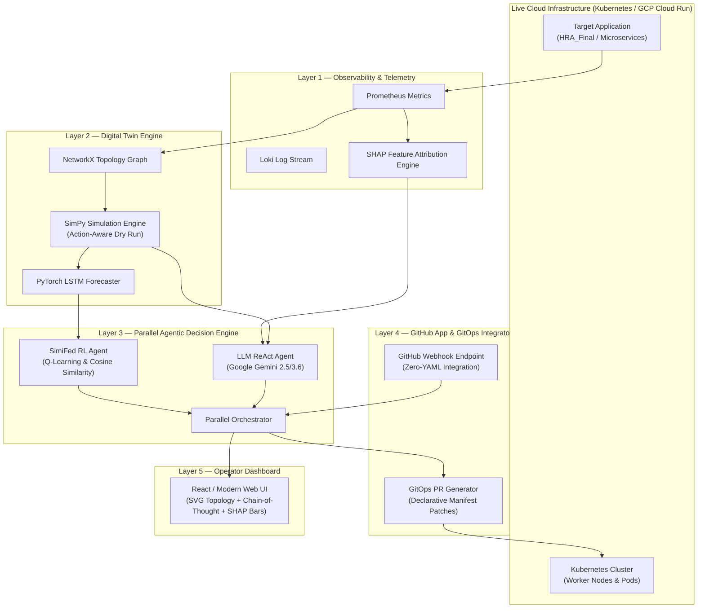

# Agentic AI Self-Healing Cloud Infrastructure

> **An Autonomous Cloud Operator powered by Digital Twin Simulations, SHAP Explainable AI, Parallel ReAct LLM Reasoning (Google Gemini), and GitHub App GitOps Integration.**

---

## 📑 Executive Overview

Modern cloud microservices suffer from cascading failures, memory leaks, and traffic spikes. Traditional cloud auto-scaling (e.g., GCP Cloud Run, Kubernetes HPA) is **reactive** (waits 3–5 minutes after CPU breaches thresholds), **one-dimensional** (can only add/remove containers), and **causes cluster drift** (temporary scaling resets when servers restart).

This project presents a **Predictive, Simulation-Gated, and Explainable Self-Healing Infrastructure**:
1. **Predictive Monitoring**: PyTorch LSTM Forecaster predicts resource exhaustion 5–10 minutes *before* failure occurs.
2. **Digital Twin Safety Gate**: SimPy discrete-event simulation runs a 0.01-second "what-if" dry run before executing any remediation (e.g., verifying if a pod restart will cut off live candidate video calls).
3. **Explainable AI (XAI)**: Isolation Forest + SHAP feature attribution pinpoints exact root causes (e.g. *"91% of memory pressure is from resume PDF parsing"*).
4. **Parallel Agent Orchestrator**: Runs a **SimiFed Q-Learning Baseline** side-by-side with a **Gemini LLM ReAct Agent** for real-time comparison of latency, action accuracy, and chain-of-thought reasoning.
5. **Zero-YAML GitHub App / GitOps Integrator**: Connects to any repository (e.g. `HRA_Final`) via 1-click Webhooks with **Zero YAML files or code changes**, auto-blocking risky PRs and generating declarative GitOps scaling PRs.

---

## 🏗️ System Architecture



---

## 🔗 Zero-YAML GitHub Integration (How to Attach to Any Repo)

Our platform acts as a plug-and-play **GitHub App / Webhook Integrator**. Developers can attach it to any repository (such as `HRA_Final`) without adding any `.yml` files or touching their application codebase.

### Setup Instructions (30 Seconds):
1. Open your target repository on GitHub (e.g. `https://github.com/AadiHaldar/HRA_Final`).
2. Go to **Settings** $\rightarrow$ **Webhooks** $\rightarrow$ **Add Webhook**.
3. Set **Payload URL**: `http://<your-server-ip>:8085/api/github/webhook`.
4. Set **Content Type**: `application/json`.
5. Select Events: **Pull Requests** and **Pushes**.
6. Click **Add Webhook**. Done!

---

## 🚀 Case Study: Implementing Self-Healing on `HRA_Final`

The `HRA_Final` application (STLD HR Interview Apps) consists of heavy AI workloads:
- `cv_matcher.py` (Resume PDF screening & criteria matching)
- `upload_recording.py` (Live candidate audio/video interview streaming)
- `email_service.py` (Automated email invite queues)

### What Happens Step-by-Step:

#### 1. Pre-Deployment PR Gate (0-YAML Verification)
- A developer opens PR #42 modifying `cv_matcher.py` in `HRA_Final`.
- GitHub Webhook sends a `pull_request` event payload to `/api/github/webhook`.
- **SimPy Digital Twin** runs a 0.01s load simulation (500 candidates uploading heavy resumes).
- If simulation predicts an `OutOfMemoryKilled` crash, the bot posts a verification report directly under PR #42 and **blocks the PR from merging**.

#### 2. Post-Deployment Crisis Auto-Healing
- On Monday at 10:00 AM, **3,000 candidates** log in simultaneously. RAM on `cv_matcher.py` spikes to **94%**.
- **SHAP Analysis** pinpoints: *"91% of memory load is caused by PDF parsing in cv_matcher.py."*
- **Digital Twin Simulation** tests:
  - *Action 1 (Restart FastAPI Backend):* ❌ **UNSAFE** (Cuts off 150 active AI voice interviews!).
  - *Action 2 (Scale `cv_matcher.py` to 6 replicas):* ✅ **SAFE** (RAM drops to 28%, live voice calls unaffected).
- **Execution:**
  - **Instant Fix:** Dynamically scales container instances in the cloud (**0s candidate downtime**).
  - **GitOps PR:** Opens a Pull Request titled `[GitOps Auto-Heal] Scale cv_matcher.py to 6 Replicas` on `HRA_Final` to fix the code permanently.

---

## ⚖️ Comparison Matrix: Standard Cloud Autoscaling vs. Our System

| Feature | Standard K8s / GCP Cloud Run | Our Agentic AI Self-Healing System |
|:---|:---|:---|
| **Trigger Mechanism** | **Reactive:** Waits for CPU > 80% for 3-5 mins | **Predictive:** LSTM predicts failure **5-10 minutes ahead** |
| **Action Space** | **One-Trick Pony:** Only adds/removes containers | **Multi-Action:** Restarts pods, patches RAM, opens GitOps PRs, or submits code fixes |
| **Pre-Execution Safety** | **None:** Spawns/kills containers blindly | **Digital Twin Dry-Run:** SimPy 0.01s simulation verifies action safety |
| **Explainability** | **None:** Black-box scalar metrics | **SHAP XAI + Gemini Chain-of-Thought Reasoning** |
| **Cluster Drift** | **Temporary:** Resets when server restarts | **Permanent:** Pushes declarative Pull Requests to your GitHub repository |
| **Repo Integration** | Requires complex YAML pipelines | **Zero-YAML 1-Click Webhook Integration** |

---

## 🖥️ Getting Started Locally

### Prerequisites
- Python 3.10+
- Google Gemini API Key (`GEMINI_API_KEY`)

### 1. Clone & Install
```bash
git clone https://github.com/AadiHaldar/Agentic-AI-Self-Healing-Cloud-Infrastructure.git
cd Agentic-AI-Self-Healing-Cloud-Infrastructure
pip install -r requirements.txt
```

### 2. Configure Environment
Create a `.env` file in the root directory:
```env
GEMINI_API_KEY=your_gemini_api_key_here
GITHUB_REPO=AadiHaldar/Agentic-AI-Self-Healing-Cloud-Infrastructure
```

### 3. Launch Dashboard & API Server
```bash
python -m uvicorn dashboard.backend.main:app --host 127.0.0.1 --port 8085
```
Open **`http://127.0.0.1:8085`** in your browser.

---

## 📁 Repository Structure

```
├── agentic_engine/
│   ├── llm_agent.py          # Gemini LLM ReAct Agent (Reasoning & Action)
│   ├── rl_agent.py           # SimiFed RL Q-Learning Baseline Agent
│   ├── orchestrator.py       # Parallel Agent Comparison Orchestrator
│   └── tools/
│       ├── github_tools.py   # GitHub App Webhook Engine & GitOps PR Generator
│       ├── k8s_tools.py      # Kubernetes Execution Tools (Scale, Restart, Patch)
│       └── simpy_tools.py    # SimPy Digital Twin Simulation Tools
├── digital_twin/
│   ├── topology_graph.py     # NetworkX Microservice Topology Graph
│   ├── simpy_engine.py       # SimPy Action-Aware Discrete Event Simulator
│   ├── predictive_forecaster.py # PyTorch Resource LSTM Time-Series Model
│   └── state_synchronizer.py # Telemetry State Sync
├── detection/
│   ├── anomaly/              # Isolation Forest Telemetry Anomaly Detector
│   ├── intrusion/            # XGBoost Network Intrusion Detection
│   └── explainer/            # SHAP Feature Attribution Explainer
├── dashboard/
│   ├── backend/main.py       # FastAPI REST API & Webhook Router
│   └── frontend/index.html   # Operator Dashboard (SVG Topology & XAI UI)
├── scripts/
│   └── ci_runner.py          # GitHub Actions Pre-Deployment Gate CLI
├── action.yml                # Composite GitHub Action Integrator Definition
└── README.md
```

---

## 📜 License & Citation

Licensed under the MIT License. Developed for College Cloud Computing & Autonomous Systems Research.
