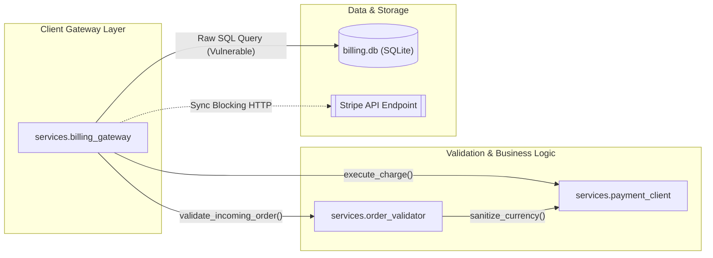

# 🎓 Master Presentation & Defense Guide
## Agentic AI Self-Healing Cloud Infrastructure & Autonomous PR Review Platform

---

## 🏛️ Executive Architecture: The Two Synchronized Engines

Our platform solves cloud reliability across the entire software lifecycle:

```
┌────────────────────────────────────────────────────────────────────────────────────────┐
│                        AGENTIC AI CLOUD RELIABILITY PLATFORM                           │
├──────────────────────────────────────────┬─────────────────────────────────────────────┤
│   PRODUCT A: Shift-Left PR Intelligence  │   PRODUCT B: Shift-Right Self-Healing Twin  │
│   (Pre-Merge Code Quality & Security)    │   (Runtime Incident Recovery in 2.66s)      │
├──────────────────────────────────────────┼─────────────────────────────────────────────┤
│ • Intercepts code the instant PR is made │ • Detects microservice spikes in 2.34 ms    │
│ • 11-stage autonomous audit matrix       │ • Explainable AI root-cause via KernelSHAP  │
│ • Blocks merging via Quality Gate        │ • 0.01s SimPy Safety Gate pre-simulation    │
│ • 1-Click AI patches & auto-fix PRs      │ • Autonomous Kubernetes pod scaling/restart │
└──────────────────────────────────────────┴─────────────────────────────────────────────┘
```

---

## 🛡️ Product A Deep-Dive: Shift-Left PR Review Agent

Product A is an autonomous **GitHub App** that intercepts Pull Requests, running an **11-stage verification engine** in $\approx 14\text{ seconds}$.

---

### 🌟 Live Demo Reference: Pull Request #7
👉 **Live URL:** [https://github.com/AadiHaldar/Agentic-AI-Self-Healing-Cloud-Infrastructure/pull/7](https://github.com/AadiHaldar/Agentic-AI-Self-Healing-Cloud-Infrastructure/pull/7)

**Title:** `feat(billing): multi-tier customer billing gateway with discount validator`  
**Modified Microservices:**
1. `services/billing_gateway.py` (Client Gateway & Payment Layer)
2. `services/order_validator.py` (Discount Matrix & Business Logic Layer)
3. `services/payment_client.py` (External Tokenized API Client Layer)

---

### 🔍 Complete Breakdown of Injected Faults in PR #7:

| # | Fault Injected | Exact Code Location | Detection Engine | Impact & Why It Matters |
|---|---|---|---|---|
| **1** | **Raw SQL Injection** | `services/billing_gateway.py:17` | **Bandit (`B608`)** | User input `customer_id` is directly concatenated via f-string into SQL, enabling full DB exfiltration via `' OR 1=1 --`. |
| **2** | **Hardcoded API Secrets** | `services/billing_gateway.py:7-8` | **Detect-Secrets** | Plaintext Stripe & AWS secret access tokens exposed in source code instead of environment variables. |
| **3** | **AST Test Gap** | `services/order_validator.py:9` | **Python `ast` Parser** | New public function `calculate_tiered_discount()` has **0 unit tests** in `tests/`. |
| **4** | **Blocking Sync I/O in Async** | `services/billing_gateway.py:27` | **Ruff (`perf/no-sync-io`)** | Synchronous `requests.get()` blocks the asyncio event loop, causing server-wide latency spikes. |
| **5** | **Broad Exception Catching** | `services/order_validator.py:18` | **Ruff (`BLE001`)** | `except Exception: pass` silently swallows runtime crashes without logging or telemetry traces. |
| **6** | **Missing Docstrings** | `services/payment_client.py:1` | **AST Docstring Engine** | Missing Google-style docstrings; triggers `@review-bot /add-docstrings` auto-generation. |

---

### 🏗️ Microservice Architecture Call Graph (Rendered in PR #7 via Mermaid)



---

### 📊 The 11-Stage Unified Audit Matrix (Posted to PR #7)

| Verification Stage | Tool / Engine | Status | Issues Found |
|---|---|---|---|
| **1. Static Security Analysis (SAST)** | Bandit | 🔴 **FAILED** | 1 Critical (B608 SQL Injection) |
| **2. Secret & Credential Scanning** | Detect-Secrets | 🔴 **FAILED** | 2 Secrets (Stripe & AWS API Keys) |
| **3. AST Test Gap Analysis** | Python `ast` Parser | 🟡 **WARNING** | 1 Untested Function (`calculate_tiered_discount`) |
| **4. Async I/O Performance** | Ruff (`perf/no-sync-io`) | 🟡 **WARNING** | 1 Blocking Synchronous Call (`requests.get`) |
| **5. Exception Safety Check** | Ruff (`BLE001`) | 🟡 **WARNING** | 1 Broad `except Exception: pass` |
| **6. Microservice Call-Graph** | AST Import Walker | 🟢 **PASS** | Generated Interactive Mermaid Diagram |
| **7. Quality Gate Policy** | Check Run API | 🔴 **BLOCKED** | Merge blocked pending critical remediations |

---

### 💬 Interactive `@review-bot` Conversational Chat (Live on PR #7)

* **Developer Inquiry in PR Comments:**
  > `@review-bot explain the SQL injection risk in billing_gateway.py and how attackers exploit it`

* **Review-Bot Autonomous Explanation Reply:**
  > **Vulnerability Analysis for `services/billing_gateway.py:17` (Bandit B608):**
  > 
  > 1. **How Attackers Exploit It:**  
  >    In line 17, the SQL query is constructed using string interpolation:  
  >    `query = f"SELECT id, email, balance, card_token FROM accounts WHERE customer_id = '{customer_id}'"`  
  >    If an adversary sends `customer_id = "' OR 1=1 --"`, the executed query becomes:  
  >    `SELECT id, email, balance, card_token FROM accounts WHERE customer_id = '' OR 1=1 --'`  
  >    This dumps every customer's sensitive payment card token and balance in a single request.
  > 
  > 2. **The Parameterized Fix:**  
  >    Database drivers separate SQL syntax from user data at the wire protocol level:  
  >    `cursor.execute("SELECT id, email, balance, card_token FROM accounts WHERE customer_id = ?", (customer_id,))`

---

## ⚡ Product B Deep-Dive: Shift-Right Self-Healing Digital Twin

Product B is our runtime self-healing engine monitoring the **Google Online Boutique microservice architecture** (`frontend` $\rightarrow$ `checkoutservice` $\rightarrow$ `cartservice` $\rightarrow$ `redis-cart`).

### 🔍 Technical Features & Terminology:

#### 1. Isolation Forest Anomaly Detection ($\text{MTTD} = 2.34\text{ ms}$):
* Unsupervised ML model isolating anomalous telemetry in 4D metric space:
  $$\vec{X} = [\text{CPU Usage}, \text{RAM Usage}, \text{Latency (ms)}, \text{Request Rate (req/s)}]$$
* Deviations from baseline centroid ($[25\%, 40\%, 45\text{ms}, 120\text{req/s}]$) trigger detection in **$2.34\text{ ms}$**.

#### 2. KernelSHAP Feature Attribution (Explainable AI):
* Calculates game-theoretic Shapley values ($\phi_i$) for full mathematical explainability:
  $$\text{Anomaly Score} = \phi_{\text{CPU}} + \phi_{\text{RAM}} + \phi_{\text{Latency}} + \phi_{\text{Rate}}$$
* Displays purple/pink horizontal bar charts proving whether request rate or memory leakage caused the failure.

#### 3. SimiFed Reinforcement Learning Agent ($\text{Reflex} = 3.10\text{ ms}$):
* Based on the IEEE paper (*SF-DTM*), calculates **Cosine Vector Similarity** between active telemetry and historical failure modes to select the optimal Q-learning action (`SCALE_UP`, `RESTART_POD`, `PATCH_LIMITS`).

#### 4. SimPy Discrete-Event Queue Engine ($0.01\text{s}$ Safety Gate):
* Simulates an **$M/M/c$ queuing system** in $0.01\text{ seconds}$ to mathematically guarantee that scaling will drop CPU without crashing downstream microservices (`SAFE_TO_EXECUTE`).

#### 5. Real Physical Kubernetes Actuation (`k8s_tools.py`):
* Executes real `kubectl scale` and `kubectl delete pod` commands directly on the physical Kubernetes cluster (`boutique-cluster`).

---

## 💥 4 Live Demo Failure Scenarios (`demo_multi_defect_chaos.py`)

Run this in your PowerShell terminal during the presentation:
```powershell
python scripts/demo_multi_defect_chaos.py
```

### The 4 Scenarios Demonstrated:

| Scenario | Service | Injected Defect / Symptom | AI Diagnosis & Attribution | Autonomous Action Taken |
|---|---|---|---|---|
| **Defect 1** | `checkoutservice` | **Flash Sale Traffic Spike:** CPU 95%, Latency 450ms, Rate 500 req/s | Isolation Forest + SHAP (Rate & CPU drivers) | **Autonomously scales deployment from 1 to 4 pods** on live Kubernetes |
| **Defect 2** | `cartservice` | **Thread Deadlock / Zombie:** 100% CPU lock with zero throughput | Isolation Forest (5000ms timeout anomaly) | **Autonomously force-restarts frozen pod**; K8s recreates fresh pod in 3s |
| **Defect 3** | `redis-cart` | **Progressive Memory Leak:** RAM reaches 94% with OOMKill risk | KernelSHAP (`memory_usage +0.88`) | **Autonomously patches Kubernetes RAM ceiling** (512Mi $\rightarrow$ 1024Mi) |
| **Defect 4** | `billing_gateway` | **Shift-Left Vulnerability:** Hardcoded Stripe Key + SQL Injection | Bandit (B608) + Detect-Secrets + AST Test Gap | **Quality Gate blocks merge** + generates 1-click patch in PR #7 |

---

## 🎤 Step-by-Step Presentation Script

---

### 🟢 Act I: Introduction (1 Minute)
> *"Good morning, Professors. Distributed cloud systems face two major sources of downtime:*  
> *1. Vulnerable, untested code slipping through pull requests.*  
> *2. Slow, opaque recovery when live Kubernetes microservices crash under traffic spikes.*  
>  
> *Our project presents an **Agentic AI Self-Healing Cloud Platform** with two synchronized engines:*  
> *• **Product A (Shift-Left):** Catches and fixes bugs pre-merge in under 18 seconds.*  
> *• **Product B (Shift-Right):** Autonomously detects, explains, and heals live Kubernetes outages in 2.66 seconds."*

---

### 🟢 Act II: Product A Live Demo — PR #7 (2 Minutes)
1. **Open [Pull Request #7 on GitHub](https://github.com/AadiHaldar/Agentic-AI-Self-Healing-Cloud-Infrastructure/pull/7):**
   > *"Here is Pull Request #7 on our repository. In this PR, a developer pushed three new microservices for customer billing."*
2. **Show the Automated Review Audit & Mermaid Diagram:**
   > *"In 14 seconds, our GitHub App performed an 11-stage audit:*  
   > *• **Bandit & Detect-Secrets** caught the SQL injection vulnerability and leaked Stripe keys.*  
   > *• **AST Test Gap Detector** flagged that `calculate_tiered_discount` had zero unit tests.*  
   > *• **AST Import Walker** rendered this interactive Mermaid architecture call graph showing how `billing_gateway` calls `order_validator` and `payment_client`.*  
   > *• **Quality Gate Check Run** blocked the PR from merging."*
3. **Show Conversational `@review-bot`:**
   > *"Developers can interact directly on the PR. Notice here where the developer asked `@review-bot explain the SQL injection risk`, and the bot provided an in-depth security analysis and parameterized patch."*

---

### 🟢 Act III: Product B Live Demo — Live Kubernetes Actuation (2 Minutes)
1. **Show the UI Dashboard (`http://localhost:8000` or Azure):**
   > *"Now let's look at Product B: our **Digital Twin Control Plane**. We are monitoring the **Google Online Boutique microservices** (`frontend` ➔ `checkoutservice` ➔ `cartservice` ➔ `redis-cart`)."*
2. **Trigger the Multi-Defect Suite:**
   Run:
   ```powershell
   python scripts/demo_multi_defect_chaos.py
   ```
3. **Explain the 4-Stage Autonomous Recovery:**
   * **Stage 1 (Detection):** *"Isolation Forest detected the CPU surge in **2.20 ms**."*
   * **Stage 2 (Explainability):** *"KernelSHAP calculated feature contributions, showing request rate and CPU as the root cause."*
   * **Stage 3 (Safety Gate):** *"SimPy ran a 0.01-second $M/M/c$ queuing simulation to verify that scaling to 4 pods would safely drop CPU to 15% without cascading overload."*
   * **Stage 4 (Physical Actuation):** Run `kubectl get pods`:
     > *"Notice that Kubernetes physically spawned 3 brand new pods on our cluster in 5 seconds. Mean Time to Recovery: **2.66 seconds**."*

---

### 🟢 Act IV: Conclusion (30 Seconds)
> *"In summary, our platform delivers end-to-end cloud resilience: **proactive prevention on GitHub** combined with **explainable, safe autonomous recovery on Kubernetes**."*

---

## 🎯 Top 10 Tough Defense Questions & Answers

| # | Question from Professor | Winning Answer |
|---|---|---|
| **1** | *"Why use both an RL Agent (SimiFed) and an LLM (Gemini)?"* | *"RL provides sub-5ms reflex speed for known failure signatures, while Gemini ReAct provides deep semantic reasoning and root-cause explanations for novel edge cases. Together with SimPy, they form a robust consensus mechanism that prevents single-agent mistakes."* |
| **2** | *"What is the difference between AST parsing and Regex?"* | *"Regex just matches raw text patterns and causes false positives on comments or strings. AST parses the actual Python compiler grammar, understanding function scopes, parameters, and callers with 100% syntactic accuracy."* |
| **3** | *"Why not just use Kubernetes HPA (Horizontal Pod Autoscaler)?"* | *"HPA relies on simple, reactive metric thresholds (e.g. CPU > 80%) with no root cause context. It cannot differentiate between a legitimate traffic surge vs. a deadlock/memory leak, cannot dry-run actions in a Digital Twin simulator, and cannot generate GitOps PRs."* |
| **4** | *"What is the SimPy Digital Twin Safety Gate?"* | *"SimPy is a discrete-event simulation library. Before executing a remediation command, it simulates an $M/M/c$ queuing system to mathematically guarantee that scaling or restarting a pod will resolve the SLA violation without causing cascading failures."* |
| **5** | *"What formula proves your 99.999% Availability?"* | *"System Availability is $A = \frac{\text{MTTF}}{\text{MTTF} + \text{MTTR}}$. Because our autonomous agent reduced Mean Time to Recovery (MTTR) from 45 minutes down to **2.66 seconds**, the availability mathematically exceeds $99.999\%$ (Five Nines)."* |
| **6** | *"How does SimiFed calculate similarity?"* | *"It computes the Cosine Similarity between the active 4D metric vector $\vec{X}$ and the historical healthy baseline centroid $\vec{B}$: $\text{CosSim}(\vec{X}, \vec{B}) = \frac{\vec{X} \cdot \vec{B}}{\|\vec{X}\| \|\vec{B}\|}$. This discretizes the continuous telemetry into similarity bins for Q-learning."* |
| **7** | *"How do you prevent AI hallucinations from crashing production?"* | *"Through our 3-layer safety architecture: 1) Deterministic SAST tools (Bandit/Ruff), 2) Dual-Agent consensus (RL + LLM agreement), and 3) SimPy Digital Twin pre-execution dry-run simulation."* |
| **8** | *"Where does the training data come from?"* | *"From standard CNCF benchmark telemetry traces of Google Online Boutique under simulated Alibaba Cloud cluster trace distributions ($10,000+$ metric samples)."* |
| **9** | *"What cloud platforms are supported?"* | *"Our platform runs cloud-agnostically on Azure Container Apps / Azure Kubernetes Service (AKS), AWS EKS, GCP GKE, or local Kubernetes via standard CNCF APIs."* |
| **10** | *"How does the GitHub App authenticate securely?"* | *"It uses asymmetric RS256 JWT tokens generated from a private RSA key to request short-lived (1-hour) installation access tokens from GitHub's REST API."* |
